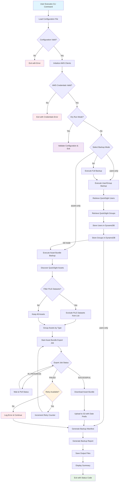
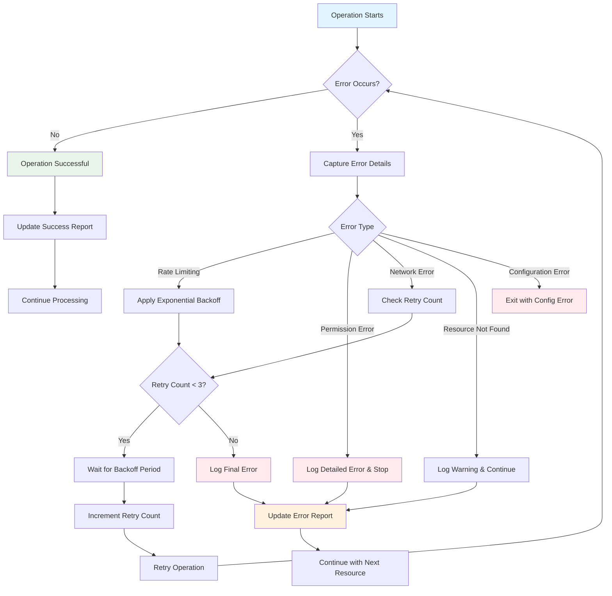
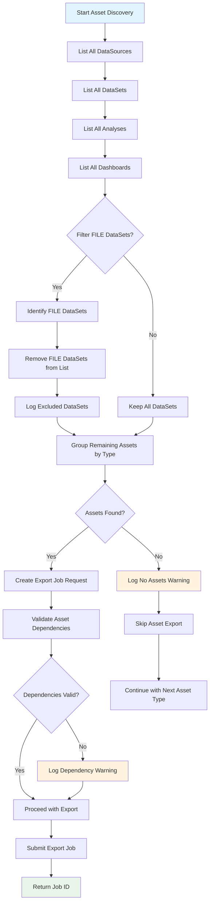
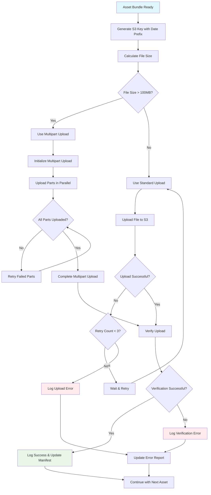
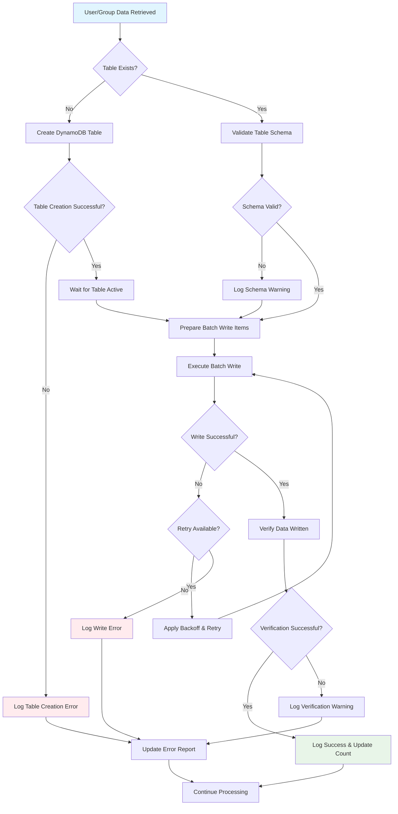

# QuickSight Backup Process Flow Diagram

## Overview Flow Diagram

## Detailed Error Handling Flow

## Asset Discovery and Filtering Flow

## S3 Upload Process Flow

## DynamoDB Storage Flow

## Key Decision Points

### 1. Backup Mode Selection
- **Full**: Execute both user/group and asset bundle backups
- **Users-only**: Execute only user/group backup to DynamoDB
- **Assets-only**: Execute only asset bundle backup to S3

### 2. Asset Filtering
- **FILE Datasets**: Always excluded from asset bundle exports per requirements
- **Dependency Validation**: Check for circular dependencies before export
- **Permission Validation**: Verify access to assets before including in export

### 3. Error Handling Strategies
- **Rate Limiting**: Exponential backoff with jitter (max 3 retries)
- **Network Errors**: Retry with backoff (max 3 retries)
- **Permission Errors**: Log and continue with accessible resources
- **Resource Not Found**: Log warning and continue

### 4. Retry Logic
- **API Calls**: Maximum 3 retries with exponential backoff
- **File Uploads**: Maximum 3 retries for network-related failures
- **Database Operations**: Maximum 3 retries for throttling errors

### 5. Output Generation
- **Manifest File**: Always generated (JSON format)
- **Report File**: Always generated (human-readable text)
- **Log Files**: Generated based on configuration
- **Progress Indicators**: Disabled in batch mode (`--no-progress`)

## Flow Execution Times

| Operation | Typical Duration | Factors Affecting Duration |
|-----------|------------------|---------------------------|
| Configuration Loading | < 1 second | File size, validation complexity |
| AWS Client Initialization | 1-5 seconds | Network latency, credential validation |
| User/Group Retrieval | 5-30 seconds | Number of users/groups, API rate limits |
| Asset Discovery | 10-60 seconds | Number of assets, API rate limits |
| Asset Bundle Export | 2-15 minutes | Asset complexity, dependencies |
| DynamoDB Storage | 5-30 seconds | Data volume, table throughput |
| S3 Upload | 30 seconds - 5 minutes | File size, network speed |
| Report Generation | < 5 seconds | Number of resources processed |

## Error Recovery Scenarios

### Scenario 1: Partial Backup Failure
- **Trigger**: Some assets fail to export
- **Response**: Continue with successful assets, log failures
- **Output**: Partial success report with detailed error information

### Scenario 2: Network Interruption
- **Trigger**: Network connectivity lost during operation
- **Response**: Retry with exponential backoff
- **Fallback**: Save progress and allow resume (future enhancement)

### Scenario 3: Permission Changes
- **Trigger**: Permissions revoked during backup
- **Response**: Log detailed error with remediation steps
- **Output**: Clear error message with required permissions

### Scenario 4: Storage Quota Exceeded
- **Trigger**: DynamoDB or S3 storage limits reached
- **Response**: Log storage error with usage information
- **Recommendation**: Suggest cleanup or quota increase